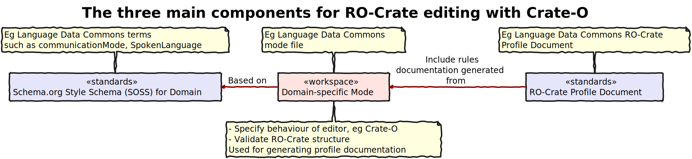

# Schemas, Profiles and Modes

This diagram shows the relationship between the three main components used by Crate-O and other tools used by the Language Data Commons of Australia for specifying and validating RO-Crates. This page explains what these components _are_ and how they relate.



1. A [_Schema_](#soss) specifies a metadata vocabulary, of Classes and Properties -- based on the RO-Crate specification's use of Schema.org classes.

2. An [RO-Crate Profile] has (at least) a document that explains how metadata entities from the Schema are used for a particular purpose.

3. An RO-Crate Mode is a set of lightweight syntactic rules for combining SOSS Classes, Properties and DefinedTerms, expressed in a JSON file that can be:
   - Loaded into an editor such as [Crate-O]
   - Imported into another program and used for RO-Crate validation
   - Used to summarise the rules for an [RO-Crate Profile]

These are all inter-related and can be developed together or separately using [tools](#tools) which are linked below.

<a name="soss"> </a>

# Schema.org Style Schemas (SOSSs) and RO-Crate Profiles and Modes

Schema.org, which is the basic vocabulary for [RO-Crate], has
a light-touch approach to describing what it refers to as its _schema_ (with a
small-s), which might also be thought of as an _ontology_. Schema.org is defined
as a set of Classes and Properties, each of which has an online definition. For
example, the base class [Thing](http://schema.org/Thing) or its subclass
[Person](http://schema.org/Person). Classes have properties such as
[birthDate](http://schema.org/birthDate).

Class: Thing → Sub-Class: Person → Property: birthDate

Schema.org specifies which Properties can occur in the `domain` of which Classes and the `range` of Classes that are expected as values for a property.

While Schema.org has Class definitions for [Class](http://schema.org/Class) and [Property](http://schema.org/Property), it does not eat its own dog food, rather it uses the equivalent Classes from the `rdf:` and `rdfs:` namespaces.

Here is the definition for Person:

```json
{
  "@id": "schema:Person",
  "@type": "rdfs:Class",
  "owl:equivalentClass": {
    "@id": "foaf:Person"
  },
  "rdfs:comment": "A person (alive, dead, undead, or fictional).",
  "rdfs:label": "Person",
  "rdfs:subClassOf": {
    "@id": "schema:Thing"
  },
  "schema:source": {
    "@id": "http://www.w3.org/wiki/WebSchemas/SchemaDotOrgSources#source_rNews"
  }
}
```

The Class definition does not have any information about the occurrence of properties -- that is found in a Property definition:

```json
{
  "@id": "schema:sibling",
  "@type": "rdf:Property",
  "rdfs:comment": "A sibling of the person.",
  "rdfs:label": "sibling",
  "schema:domainIncludes": {
    "@id": "schema:Person"
  },
  "schema:rangeIncludes": {
    "@id": "schema:Person"
  }
}
```

A Schema.org Style Schema, which we are calling a 'SOSS', is a Flattened JSON-LD graph, just like an RO-Crate. Some members of the RO-Crate community are beginning to define its basic schema and RO-Crate Profiles using the same approach.

To make an RO-Crate Mode File, we transform the flat graph of a schema into something optimised for driving an editor or a validator -- it creates a list of Classes, and what properties each may have.


We (the tech-team members of Language Data Commons of Australia (LDaCA)) used this process to create the basic [RO-Crate Editor Profile](../profiles/base-profile.json) in this repository.

# Initial approach to managing related Mode files

There are some use cases where it will be necessary to manage subsets or variants of modes. For example, specifying a set of modes that work at different levels of granularity to implement a profile such as the Language Data Commons RO-Crate profile <https://w3id.org/ldac/profile>, for different use cases. The LDAC profile allows for RO-Crates that describe crates with a @type of RepositoryCollection (which may or may not have nested entities of @type RepositoryCollection or RepositoryObject within them) or with a @type of RepositoryObject.

The initial approach to Mode files does not include any mechanism for inheritance or importing modules in the mode files themselves, rather it will focus on creating tools which allow for derivation of stand-alone modes that are 'filtered' out of larger modes. For example, in the case of the LDAC RO-Crate profile, sub-modes will be developed using scripts from an all-inclusive mode.

<a name="tools"> </a>

# Tools for managing and creating Modes and SOSSs

The team at the Language Data Commons of Australia manages a set of tools for creating SOSS and Mode files [ro-crate-schema-tools]. This includes a tool to:

- Infer a SOSS from a set of example RO-Crate documents using the rocsoss script. This looks for the relationships between Classes and Properties in a set of examples and generates a Schema.org Style Schema (SOSS) that captures this.

- Generate Mode files from SOSSs.

- Do both of the above in one go; generating a mode file that can be used in [Crate-O], for validation, and to provide documentation for an RO-Crate Profile using the profile tool in this repository.


# Documenting and Validating an RO-Crate Profile

This git repository contains a Javascript class Profile which can be used to generate English language summaries in tabular format for a profile documentation, slotting them into a Markdown document with placeholders for the rules.

We don't have complete documentation for this, but you can see it used in [the documentation of the Language Data Commons Profile](https://github.com/Language-Research-Technology/ldac-profile/blob/master/make-profile.js).

[Crate-O]: https://github.com/Language-Research-Technology/crate-o
[RO-Crate]: https://www.researchobject.org/ro-crate/
[RO-Crate Profile]: https://www.researchobject.org/ro-crate/1.2-DRAFT/profiles.html
[ro-crate-schema-tools]: https://github.com/Language-Research-Technology/ro-crate-schema-tools
[RO-Crate]: https://www.researchobject.org/ro-crate/
